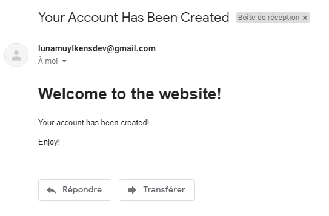
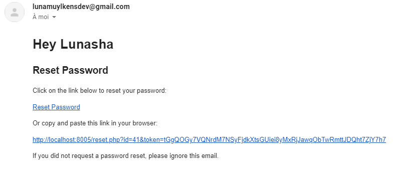
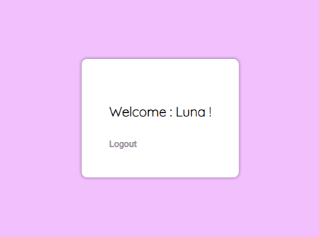
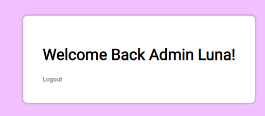
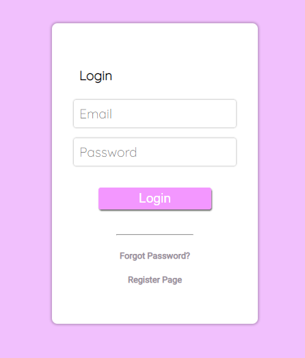
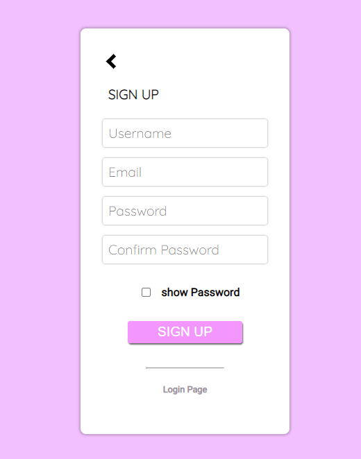
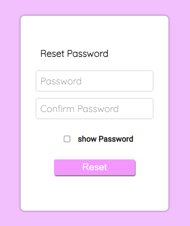

Login-Register-PHP by Lunasha / Luna Muylkens
===
## README Parts:
    1. Technologies used
    2. Require
    3. Extension In PHP.ini
    4. Composer
    5. Env
    6. Configure Database
    7. How to use DotEnv ?
    8. How to use PHPMailer ?
    9. Functionnalities about your Login/Register ?
    10. Design
    11. Mail Design
    12. How i can use your project ?
    13. In The future ? 
## Technologies used ?

## Require ?
    PHP
    Composer
    MYSQL/MariaDB Server
    GMAIL Account / SMTP
    APACHE / or : php -S localhost:8000 -> (PHP Server localhost in Terminal)
[Download Composer](https://getcomposer.org/) 
[Download XAMPP (MYSQL & Apache)](https://www.apachefriends.org/fr/index.html)

## Extension in PHP.ini  ?
    extension=mysqli
    extension=pdo_mysql //If you use PDO
## Composer :
    composer require phpmailer/phpmailer
    composer require vlucas/phpdotenv

## Env :
    server=YOUR_SERVER_MYSQL
    user=YOUR_USER_SERVER
    password=YOUR_PASSWORD_SERVER
    database=YOUR_DATABASE
    SMTP_password=GMAIL_PASSWORD
    SMTP_account=GMAIL_EMAIL
    SMTP_server=smtp.gmail.com //Can be changed, i use GMAIL SMTP personally
    SMTP_from=GMAIL_FROM_EMAIL
    SMTP_name=GMAIL_NAME

## Configure Database SQL :
    //Create The Database, Replace : NAME_OF_THE_DATABASE 
    CREATE DATABASE NAME_OF_THE_DATABASE;

    //Create The Table
    CREATE TABLE `users` (
        `id` int(11) NOT NULL,
        `permission` int(11) NOT NULL,
        `username` varchar(255) NOT NULL,
        `email` varchar(255) NOT NULL,
        `password` varchar(255) NOT NULL,
        `reset_token` varchar(255) NOT NULL
    ) ENGINE=InnoDB DEFAULT CHARSET=utf8mb4;

## How use DotENV ?

    require_once './vendor/autoload.php'; //Load all packages

    $dotenv = Dotenv\Dotenv::createImmutable(__DIR__); //.env file in the route

    $dotenv->load(); //Load Dotenv

    $_ENV['NAME'] //Take a element in the .ENV file
    
    

## How use PHP Mailer with GMAIL ?
    Lunasha : For the first part, you need to activate multiple options in your GMAIL account

    Gmail Parameter -> "See All settings" -> "Forwarding and POP/IMAP" -> [x] "Enable IMAP" -> Save Changes

    Lunasha : For the Second Part, you need to active one option in your GOOGLE account 
    Manage your google Account -> Security -> "Less secure app access" -> [X] ON

    Lunasha : For the last part is just load PHPMailer & Configure with PHP & ENV File

    use PHPMailer\PHPMailer\PHPMailer;
    use PHPMailer\PHPMailer\SMTP;
    use PHPMailer\PHPMailer\Exception;

    require './vendor/phpmailer/phpmailer/src/PHPMailer.php';	
    require './vendor/phpmailer/phpmailer/src/SMTP.php';	
    require './vendor/phpmailer/phpmailer/src/Exception.php';

    // You can just load vendor/autoload.php (Don't need 3 require for work)

    $mail = new PHPMailer(true); // Activate PHPMailer 

    //PHP CODE
    try{
        $mail->IsSMTP(); //SMTP Activate
        $mail->SMTPAuth = 1;
        $mail->Host = $_ENV['SMTP_server']; //Your SMTP Server         
        $mail->Port = 465; //SMTP PORT                    
        $mail->SMTPSecure = 'ssl'; //Activate the SSL

        $mail->Username   =  $_ENV['SMTP_account']; //Your Email/GMAIL ACCOUNT
        $mail->Password   =  $_ENV['SMTP_password']; //Your Email/GMAIL PASSWORD
        $mail->setFrom($_ENV['SMTP_from']);  //Mail send by ...
        $mail->addReplyTo($_ENV['SMTP_account'], $_ENV['SMTP_name']); //Mail for the user reply if he needs something

        $mail->Subject    = 'Your Account Has Been Created'; //Mail TITLE
        $mail->Body       = 'Your account has been created. Your account is now ready to use.'; // Mail BODY
        // $mail->IsHTML(true); If you want send HTML Mail, it's possible!

    } catch (Exception $e) {
        echo 'Message could not be sent. Mailer Error: ', $mail->ErrorInfo;
    }

    <!> CHANGE THE ENV FILE, IS REALLY FAST <!>

## Mail ?
 
 

## Functionnalities about your Login/Register ?
    Register with MAIL //If a Mail Adress is already exist -> Error
    Login 
    Welcome
    Password forgot  //With your Email Adress -> Link Mail 
    Reset Password //With ID & Reset Token 
    Show Password in Reset & Register

    New : 
    Admin Permission & Admin Page
    Reset Password With ID & Reset_Token ( In the past With Email & Reset_Token )
    Input more Secure ( XSS ) -> Username /Password auto Encrypt & Mail auto detection if /<>-&...

## Design 
 
 
 
 
 
 

## How i can use your project ?
    Lunasha: If you follow all parts & changed .ENV File & Activate SMTP to your GOOGLE Account
             Just go in a server or Localhost !

## In The future ? 
    Lunasha: Login with Cookies & Login with IP Confirmation
             Time in Reset Password (15 Minutes)
             Improve the Welcome File
             More Secure with Password BCRYPT
             Connect with Google Account
             Improve Mail Body

